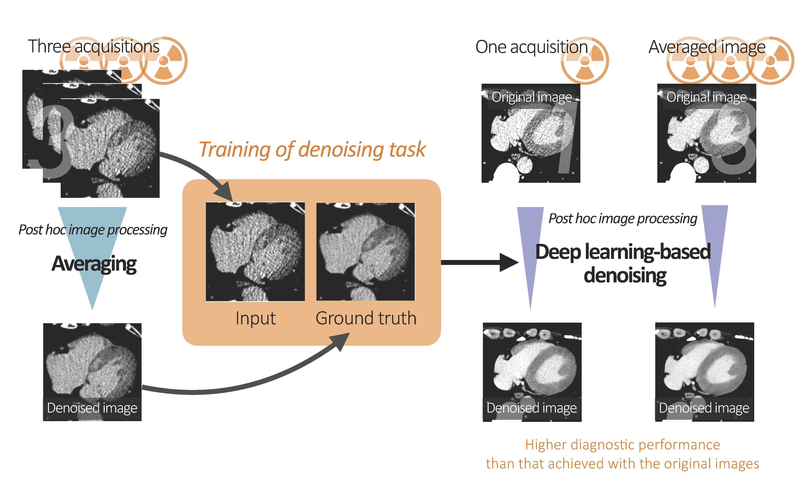

# Deep-Learning-Based Post Hoc CT Denoising For Myocardial Delayed Enhancement 

This repository is the official implementation of:  
[Deep-Learning-Based Post Hoc CT Denoising For Myocardial Delayed Enhancement](https://pubs.rsna.org/doi/10.1148/radiol.220189) and  
[Deep learning-based noise reduction for coronary CT angiography: using four-dimensional noise-reduction images as the ground truth](https://journals.sagepub.com/doi/abs/10.1177/02841851221141656).

We used Residual Dense Network (RDN) for the denoising task in a myocardial delayed enhancement (MDE) CT and coronary CT angiography.

Our methods for creating ground-truth images are described in the paper.
The detailed scan and reconstruction parameters in MDE CT are described in Supplemental Table 1.

### Residual Dense Network
The original papers and official codes of RDN are at the following links.

[Residual Dense Network for Image Restoration](https://ieeexplore.ieee.org/document/8964437)  
[Code](https://github.com/yulunzhang/RDN)

## Data Availability
The data underlying this article cannot be shared publicly due to for the privacy of individuals that participated in the study. The data will be shared on reasonable request to the corresponding author. 
